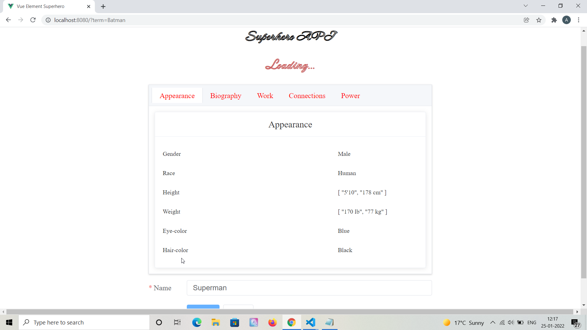

<h3 align="center">
	Superhero API app in Vue and Element UI
</h3>

<h1 align="center">
	
</h1>

## Overview

- **Made in Vue.** A progressive modern front-end Javascript framework to build blazing fast SPA applications.

- **API Integration.** Integrates with superhero API - https://superheroapi.com/ to display data of over 700 superheroes from Marvel and DC universe.
- **Element UI.** Uses Element UI for grid, button, cards and other components with custom CSS.

## Development Setup

Please install node modules through npm install command, add a vue config file to configure prox settings.

```
npm install

// For making a build and deploying for production
npm run build

// For development
npm run serve

```

## Project Screenshots

Please find some of the application screenshots below. The application only has a single page so these screenshots are different sections of the same page.




